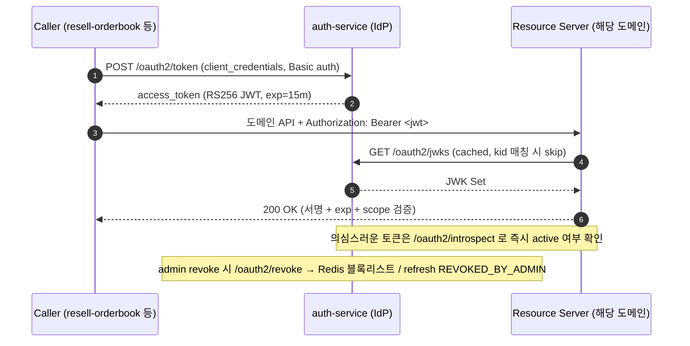

# auth-service

[](https://github.com/ssa1004/auth-service/actions/workflows/ci.yml)
[](LICENSE)

OAuth2 / OIDC IdP. 다른 internal service 들이 JWT 를 검증하는 consumer 라면 이 서비스는
JWT 를 발행하는 issuer 입니다. JWT 발행, JWK rotation, refresh token rotation, RBAC,
multi-tenant, 2FA, audit 를 한 묶음으로 제공합니다.

- Spring Boot 3.4 / Java 21 / Spring Authorization Server 1.4
- Postgres + Flyway + JPA / Redis (refresh reuse 감지, rate limit, MFA challenge)
- 헥사고날 (ports & adapters) + 모듈 6개
- ADR 18개로 핵심 결정 정리 ([docs/adr](docs/adr)) — RBAC + ABAC (OPA), JWK rotation, Refresh
  reuse detection (+ grace), 2FA TOTP, Audit append-only, RFC 7662 Introspection,
  RFC 7009 Revocation 등

---

## 모듈

| 모듈 | 역할 |
| --- | --- |
| `auth-domain` | User / Tenant / Role / Permission / RefreshToken / MfaSecret / AuditEvent. Spring 의존성 0 |
| `auth-application` | 11개 use case + in/out port. `@Service` / `@Transactional` 까지만 |
| `auth-adapter-out` | JPA / Redis / TOTP / BCrypt / AES-GCM / Nimbus JOSE 구현체 |
| `auth-adapter-in` | REST controller + Spring Authorization Server endpoint |
| `auth-bootstrap` | Spring Boot main + JWK rotation + `SecurityFilterChain` 조립 + Flyway |
| `e2e-tests` | Postgres + Redis Testcontainer 통합 시나리오 |

## 11개 use case

| use case | 핵심 |
| --- | --- |
| `RegisterUserUseCase` | email + password (BCrypt cost=12) + tenant. 메일 verification mock |
| `LoginUseCase` | bad credentials / locked / not-found 모두 동일한 응답으로 정보 누설을 차단. MFA 활성 사용자는 401 + `mfaToken` |
| `VerifyMfaUseCase` | TOTP 검증. challenge 토큰은 1회 consume (replay 차단). tenant context 보존 |
| `RefreshTokenUseCase` | rotation + reuse detection. 회전된 token 이 다시 들어오면 모든 세션을 강제 revoke (grace window 5초 — 같은 IP 의 mobile retry 보호) |
| `RevokeSessionUseCase` | 사용자가 자신의 세션 목록에서 특정 세션을 즉시 revoke |
| `ListMySessionsUseCase` | 활성 refresh 목록 (디바이스 / IP / 마지막 사용 시각) |
| `AssignRoleUseCase` | 운영자가 사용자에 role 부여. cross-tenant role 부여 거부 |
| `AuditLoginAttemptsUseCase` | append-only audit. `REQUIRES_NEW` 로 호출 트랜잭션 rollback 무관 |
| `LinkOrCreateUserFromOidcUseCase` | Google OIDC consumer — 외부 IdP 사용자와 매핑 / 자동 가입 |
| `IntrospectTokenUseCase` | RFC 7662 — access JWT / refresh 의 active 여부 + claim 응답. 외부 issuer / 가짜 / revoke 모두 `{active:false}` |
| `RevokeTokenByAdminUseCase` | RFC 7009 — admin 의 강제 revoke. access JWT 는 Redis 블록리스트 (잔여 TTL), refresh 는 `REVOKED_BY_ADMIN` 상태 |

## 핵심 패턴

- **Spring Authorization Server 1.4** — `/oauth2/token`, `/oauth2/jwks`,
  `/.well-known/openid-configuration` 자동 노출. 자체 first-party endpoint
  (`/api/v1/auth/*`) 와 공존.
- **JWK rotation** — RS256 / RSA 2048. 24h cycle + previous 키 1 cycle grace ([ADR-0003](docs/adr/0003-jwk-rotation-strategy.md))
- **Refresh token rotation + reuse detection** — refresh rotation 패턴. SHA-256 hash 만
  DB 보관, 평문 로그 / DB 금지 ([ADR-0004](docs/adr/0004-refresh-token-rotation-and-reuse-detection.md))
- **RBAC** — User → Role → Permission. JWT claim 에 `roles` + `permissions` 를 담음 ([ADR-0005](docs/adr/0005-rbac-vs-abac.md))
- **Multi-tenant 격리** — JWT `tnt` claim + 모든 query 에 tenant_id 강제 ([ADR-0006](docs/adr/0006-multi-tenant-data-isolation.md))
- **TOTP 2FA** — RFC 6238, AES-GCM 암호화 secret. WebAuthn 후속 ([ADR-0007](docs/adr/0007-mfa-totp-vs-sms-webauthn.md))
- **Append-only audit log** — 보안 사고 사후 분석 ([ADR-0008](docs/adr/0008-audit-log-append-only.md))
- **Rate limit** — bucket4j-lettuce CAS, `(IP, tenant, email)` 키. brute-force 차단

## 보안 점검 항목

- 평문 비밀번호 / TOTP secret / refresh token 평문은 도메인 객체에 들어오지 않습니다.
  - User: `passwordHash` 만, BCrypt 결과 (cost 12).
  - MfaSecret: `secretCipher` 만, AES-GCM 암호화. master key 는 환경변수 / KMS.
  - RefreshToken: `tokenHash` (SHA-256) 만, `unique` 제약 + 비관적 잠금.
- 도메인 객체 `toString` 은 평문 / hash 모두 노출하지 않습니다 — 디버그 / 로그 / audit
  어디서도 안전.
- Email 은 PII 로 마스킹 (`alice@example.com` → `a***e@e***e.com`).
- `application.yml` 에 master key 평문 금지 — `${AUTH_MFA_AES_KEY}` placeholder 만 둡니다.
- `audit_events` 테이블에는 평문 비밀이 절대 들어가지 않습니다 (호출자가 마스킹 책임).

## 빠른 시작

```bash
# 로컬 개발 (Postgres + Redis + Mailhog + auth)
docker compose -f infrastructure/docker/docker-compose.yml up --build

# 또는 로컬 인프라만 띄우고 IDE 에서 :auth-bootstrap:bootRun
docker compose -f infrastructure/docker/docker-compose.yml up postgres redis mailhog
./gradlew :auth-bootstrap:bootRun
```

OIDC discovery: `http://localhost:8080/.well-known/openid-configuration`
JWKS: `http://localhost:8080/oauth2/jwks`
OpenAPI UI: `http://localhost:8080/swagger-ui.html` (env `AUTH_OPENAPI_ENABLED=true` 필요)
Mailhog UI: `http://localhost:8025`

> 운영(production)에서는 OpenAPI / Swagger UI 노출을 끄는 것을 기본으로 합니다
> (`AUTH_OPENAPI_ENABLED=false`, default). IdP 의 endpoint 매핑 정보가 외부에 보일
> 이유가 없고, 내부 사용 시 사설망 / VPN 안에서만 접근하도록 합니다.

## 주요 호출 흐름

```bash
# 1) 회원가입
curl -X POST localhost:8080/api/v1/auth/register \
  -H 'Content-Type: application/json' \
  -d '{"tenantSlug":"acme","email":"alice@example.com","password":"longenoughpw1234"}'

# 2) 로그인 → access + refresh
curl -X POST localhost:8080/api/v1/auth/login \
  -H 'Content-Type: application/json' \
  -d '{"tenantSlug":"acme","email":"alice@example.com","password":"longenoughpw1234"}'

# 3) refresh 회전
curl -X POST localhost:8080/api/v1/auth/refresh \
  -H 'Content-Type: application/json' \
  -d '{"refreshToken":"<plain>"}'

# 4) MFA 활성 사용자 — 1단계 (비밀번호) 응답에 mfaToken
curl -X POST localhost:8080/api/v1/auth/verify-mfa \
  -H 'Content-Type: application/json' \
  -d '{"mfaToken":"<from login>","code":"123456"}'

# 5) 내 세션 목록 / revoke
curl -H 'Authorization: Bearer <access>' localhost:8080/api/v1/me/sessions
curl -X DELETE -H 'Authorization: Bearer <access>' localhost:8080/api/v1/me/sessions/<sessionId>

# 6) Token Introspection (ADR-0017) — Resource Server 가 access / refresh 의 유효성을 직접 확인
curl -X POST localhost:8080/oauth2/introspect \
  -u internal-service:internal-service-secret-change-me \
  -d 'token=<access_or_refresh>&token_type_hint=access_token'

# 7) Token Revocation (ADR-0018) — 운영자 / 보안 콘솔이 강제 종료 (token.revoke scope 필요)
curl -X POST localhost:8080/oauth2/revoke \
  -u internal-admin:internal-admin-secret-change-me \
  -d 'token=<access_or_refresh>&token_type_hint=refresh_token'
```

### Resource Server 측 introspection 가이드

introspect 는 매 요청마다 IdP 왕복이라 *Resource Server 측 cache* 가 필수입니다.
권장값:

- TTL = **10초** — admin revoke (ADR-0018) 가 모든 노드에 반영되는 SLA 가 최대 10초.
  더 길게 잡으면 사용자 정지 시나리오의 차단 지연이 길어집니다.
- 키 = `sha256(token)` — 평문 토큰을 cache 키로 두지 않음 (메모리 dump 위험).
- introspect 응답의 `exp` 가 cache 만료보다 더 가까우면 그 시점까지만 cache.

## 빌드 / 테스트

```bash
./gradlew check           # 모든 모듈 단위 + 통합 + e2e (Postgres + Redis 컨테이너)
./gradlew :auth-domain:test
./gradlew :auth-application:test
./gradlew :e2e-tests:test
```

테스트 카운트:
- domain: 26
- application: 53
- adapter-in: 13
- adapter-out: 46 (OPA Rego ↔ embedded 동등성 21 케이스 포함)
- bootstrap: 8
- e2e: 17 (OpenAPI spec 정확성 4 + JWK rotation 시나리오 2 포함)

## 인프라

- `Dockerfile` — multi-stage (gradle build → temurin-21-jre-alpine), non-root, healthcheck.
- `infrastructure/docker/docker-compose.yml` — postgres / redis / mailhog / auth.
- `infrastructure/k8s/` — namespace / configmap / secret(skeleton) / deployment / service
  / hpa / pdb. `readOnlyRootFilesystem`, `runAsNonRoot`, `seccomp RuntimeDefault`,
  `drop ALL caps`.
- `helm/auth-service/` — 같은 manifest 의 Helm chart 버전. dev / staging / prod 환경 분기를
  values 로 처리 (자세한 설명은 [Deployment](#deployment) 절).
- `.github/workflows/ci.yml` — `workflow_dispatch` only. `./gradlew check` → docker buildx
  (no push).

## Deployment

raw K8s manifest (`infrastructure/k8s/`) 와 동일한 모양을 Helm chart 로도 제공합니다.
환경별 분기를 `values.yaml` (dev) / `values-prod.yaml` (prod) 로 나눠 관리합니다.

```bash
# dev — 기본 values
helm install auth-service ./helm/auth-service \
  --namespace auth --create-namespace

# prod — values-prod.yaml override + image tag / host 주입
helm upgrade auth-service ./helm/auth-service \
  --namespace auth \
  --values ./helm/auth-service/values-prod.yaml \
  --set image.tag=v0.1.0 \
  --set ingress.hosts[0].host=auth.your-domain.com

# 검증
helm lint ./helm/auth-service
helm template ./helm/auth-service --values ./helm/auth-service/values-prod.yaml
```

prod 차이: replica 3 + HPA (cpu 70% / memory 80%, min 2 max 10), ingress + TLS, 보수적 probe
threshold, OPA sidecar (ADR-0016), JWK 는 KMS / Vault (`secret.create=false` + `extraEnvFrom`
로 외부 SealedSecret / ExternalSecret 참조). 자세한 사용법은
[`helm/auth-service/README.md`](helm/auth-service/README.md) 참고.

## Portfolio Set 통합

이 레포는 단독 IdP 가 아니라 8 레포 포트폴리오의 *issuer* 입니다. 다른 7 레포는 본 레포가
발급한 JWT 를 받아 resource server 로서 검증합니다 (JWK Set 공개 — `/oauth2/jwks`,
introspect — `/oauth2/introspect`, revoke — `/oauth2/revoke`). 프로필 README:
[ssa1004/ssa1004](https://github.com/ssa1004/ssa1004).

| 레포 | 한 줄 소개 | 본 레포와의 관계 |
| --- | --- | --- |
| [auth-service](https://github.com/ssa1004/auth-service) | OAuth2 / OIDC IdP — JWT 발행 / JWK rotation / 2FA / introspect / revoke | 자신 (issuer) |
| [resell-orderbook](https://github.com/ssa1004/resell-orderbook) | 주문 매칭 엔진 + 동시성 제어 | client_credentials 로 token 발급 후 주문 API 호출 |
| [billing-platform](https://github.com/ssa1004/billing-platform) | 사용량 집계 / 청구서 / 결제 게이트웨이 | client_credentials 로 token 발급 후 결제 API 호출 |
| [gpu-job-orchestrator](https://github.com/ssa1004/gpu-job-orchestrator) | GPU job 큐 / 스케줄러 | client_credentials 로 token 발급 후 job submit |
| [search-service](https://github.com/ssa1004/search-service) | 검색 색인 + 질의 (OpenSearch) | client_credentials 로 색인 갱신 / 질의 |
| [notification-hub](https://github.com/ssa1004/notification-hub) | 알림 fan-out (mail / push / slack) | client_credentials 로 알림 발송 trigger |
| [security-log-search](https://github.com/ssa1004/security-log-search) | 감사 로그 / 보안 이벤트 검색 | 본 레포의 audit log 를 SIEM outbox 로 수신 |
| [mini-shop-observability](https://github.com/ssa1004/mini-shop-observability) | MSA + observability 플레이그라운드 | 모든 레포 metric / trace / log 의 통합 대시보드 |

### 발급 → 검증 흐름



검증 비용 절감을 위해 resource server 측은 JWK Set 을 캐싱하고 (kid mismatch 시에만 재조회),
introspect 는 의심 / 강제 차단 시나리오에서만 호출합니다 (위 "Resource Server 측 introspection
가이드" 참고).

### 통합 시연

레포 안에서 `client_credentials` 발급 → 가상 resource server 호출 → introspect → revoke 까지
한 번에 돌려볼 수 있는 데모를 제공합니다.

```bash
# auth + demo resource server (nginx + JWKS 검증) 띄움
docker compose -f infrastructure/docker/docker-compose.integration.yml up -d --build

# 발급 / 호출 / introspect / revoke 시연
./scripts/integration-demo.sh
```

데모 resource server 는 OpenResty + lua-resty-jwt 로 본 레포의 JWK Set 을 가져와 RS256
서명 / `exp` / `iss` 를 in-process 검증합니다. 외부 의존은 컨테이너 안에서 닫혀 있고 실 외부
API 호출은 없습니다.

## Load test

[k6](https://k6.io/) (JS 시나리오 부하 도구) 로 OAuth2 endpoint 부하 / refresh rotation
invariant 를 검증합니다. 자세한 시나리오 / 임계 / 측정 항목은
[`load/README.md`](load/README.md).

| 시나리오 | endpoint | 패턴 | 임계 |
| --- | --- | --- | --- |
| token-issue | `POST /oauth2/token` (client_credentials) | constant 500 req/s | p95 < 100ms |
| token-introspect | `POST /oauth2/introspect` (RFC 7662) | constant 1000 req/s | p95 < 20ms (Redis 캐시 적중) |
| jwks-fetch | `GET /oauth2/jwks` | constant 2000 req/s | p95 < 10ms (정적 + 캐싱) |
| login-refresh | `POST /auth/login` → `/auth/refresh` | ramping 0 → 100 VU | login/refresh p95 < 150ms, err < 1% |
| refresh-reuse-detection | refresh 의도적 reuse | 1 VU N iterations | 두 번째 사용 → 401 + family revoke 100% |

```bash
brew install k6
# 단일 실행
k6 run load/k6/scenarios/token-issue.js
# 일괄 실행 (사용자 사전 register 포함)
./scripts/run-load.sh
```

## ADR

18개 ADR 로 핵심 결정을 정리했습니다. 각 ADR 는 결정의 배경 / 선택 / 근거 / 장단점을
짧게 정리하는 형식입니다.

| 번호 | 제목 |
| --- | --- |
| [0001](docs/adr/0001-hexagonal-and-spring-authorization-server.md) | 헥사고날 + Spring Authorization Server 도입 |
| [0002](docs/adr/0002-rs256-vs-eddsa.md) | RS256 vs EdDSA — JWT 서명 알고리즘 선택 |
| [0003](docs/adr/0003-jwk-rotation-strategy.md) | JWK rotation 24h + grace period |
| [0004](docs/adr/0004-refresh-token-rotation-and-reuse-detection.md) | Refresh token rotation + reuse detection |
| [0005](docs/adr/0005-rbac-vs-abac.md) | RBAC vs ABAC — RBAC 로 시작 |
| [0006](docs/adr/0006-multi-tenant-data-isolation.md) | Multi-tenant 격리 — JWT claim + query filter |
| [0007](docs/adr/0007-mfa-totp-vs-sms-webauthn.md) | 2FA TOTP 선택 (WebAuthn 후속) |
| [0008](docs/adr/0008-audit-log-append-only.md) | Audit log append-only |
| [0009](docs/adr/0009-hikaricp-tuning-and-leak-detection.md) | HikariCP 튜닝 + leak detection |
| [0010](docs/adr/0010-k8s-three-probes-and-readiness-coordinator.md) | K8s 3종 probe + readiness coordinator |
| [0011](docs/adr/0011-graceful-shutdown.md) | Graceful shutdown — SIGTERM 처리 |
| [0012](docs/adr/0012-audit-siem-outbox.md) | Audit log SIEM 아웃박스 |
| [0013](docs/adr/0013-social-login-oidc-skeleton.md) | Social login (OIDC) skeleton |
| [0014](docs/adr/0014-key-material-source-abstraction.md) | JWK 외부 KMS 추상화 |
| [0015](docs/adr/0015-refresh-reuse-grace-window.md) | Refresh reuse 의 grace window |
| [0016](docs/adr/0016-opa-policy-decision.md) | OPA 기반 ABAC 정책 엔진 도입 |
| [0017](docs/adr/0017-token-introspection-rfc-7662.md) | Token Introspection (RFC 7662) — JWT self-validate vs introspection |
| [0018](docs/adr/0018-token-revocation-rfc-7009.md) | Token Revocation (RFC 7009) — admin 강제 revoke 표준 endpoint |

## 후속 작업

- WebAuthn / passkey — 디바이스 등록 / 복구 흐름 ([ADR-0007](docs/adr/0007-mfa-totp-vs-sms-webauthn.md))
- ABAC — 정책 엔진 (OPA / Casbin) 도입 ([ADR-0005](docs/adr/0005-rbac-vs-abac.md))
- Social login — 추가 OIDC provider 확장 ([ADR-0013](docs/adr/0013-social-login-oidc-skeleton.md))
- SAML 2.0 — 엔터프라이즈 SSO
- JWK 외부 KMS 주입 — k8s leader election + Vault dynamic secrets ([ADR-0014](docs/adr/0014-key-material-source-abstraction.md))
- audit log SIEM sink — Kafka → ClickHouse / S3+Athena ([ADR-0012](docs/adr/0012-audit-siem-outbox.md))
- refresh token grace window 의 IP 매칭 정밀도 개선 ([ADR-0015](docs/adr/0015-refresh-reuse-grace-window.md))

## 라이선스

[MIT](LICENSE)
